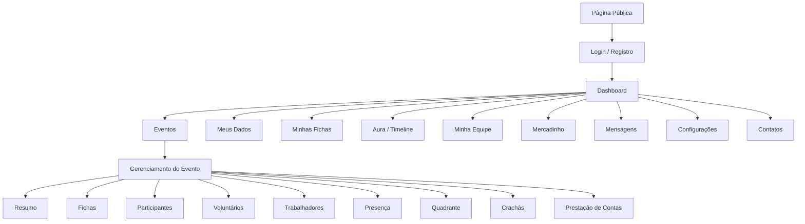
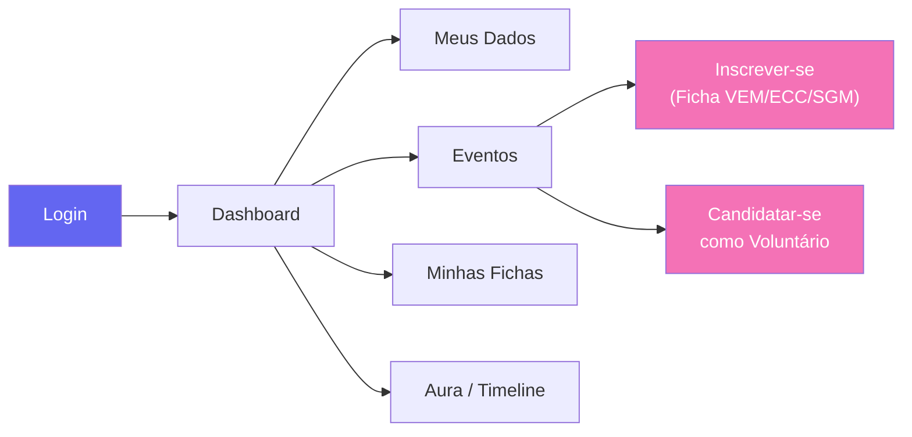
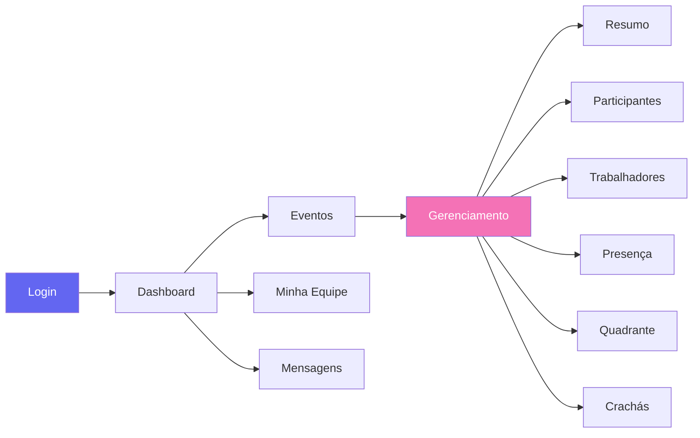
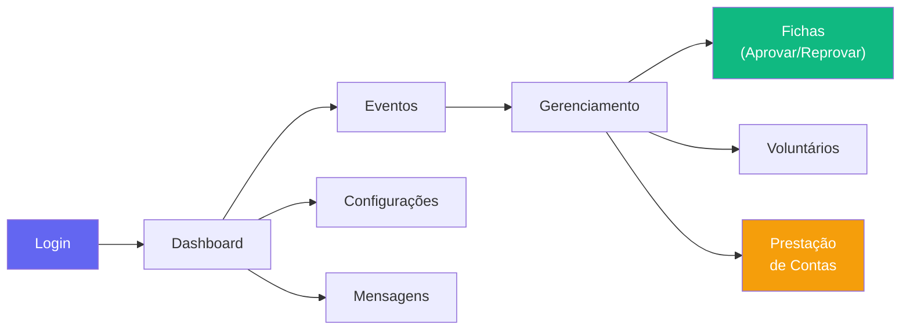
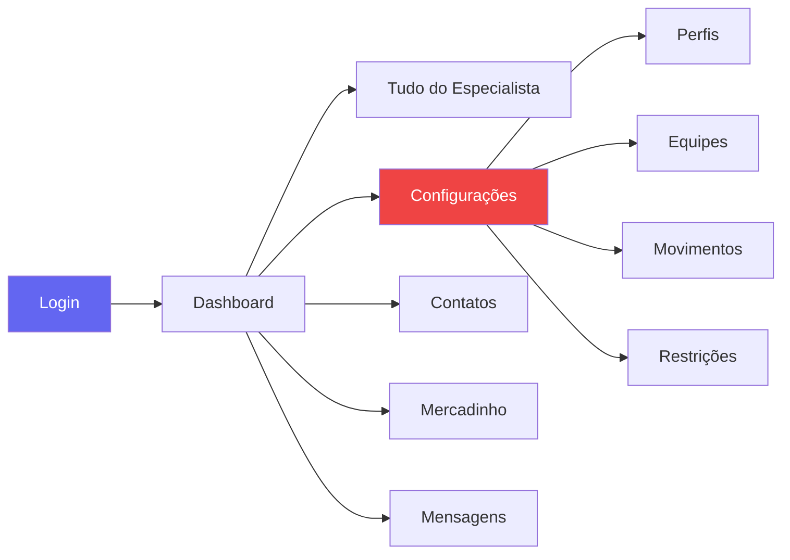
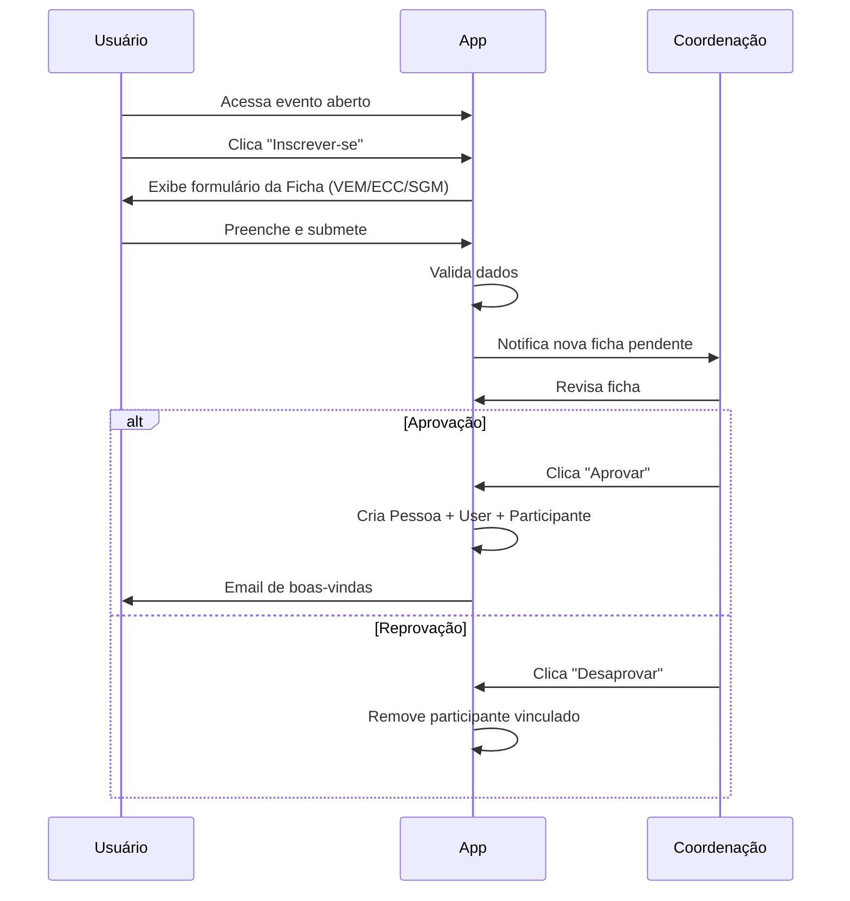
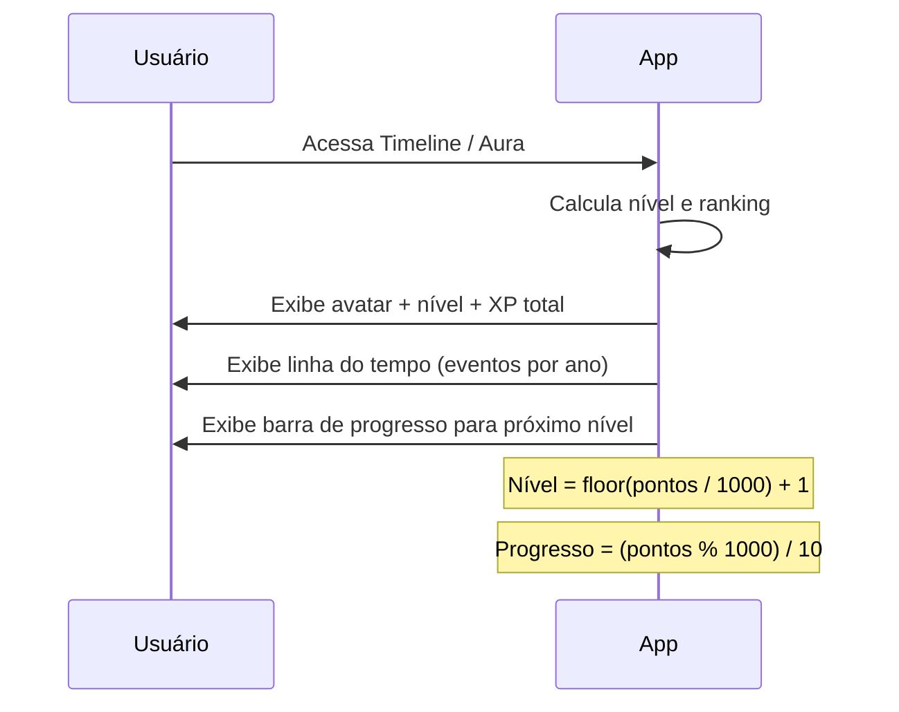

# DESIGN.md — Movimento Canônico

**Documento de Governança Visual e UX**
**Versão:** 1.0
**Data:** Julho de 2026
**Tipografia:** Nunito · **Paleta:** Indigo & Coral

> Este documento é a **fonte de verdade** para toda decisão visual, de layout, de acessibilidade e de experiência do usuário na aplicação Movimento Canônico.
> Toda nova tela, componente ou modificação de UI **deve** seguir estas diretrizes.

---

## 1. Identidade Visual

### Filosofia

A aplicação é jovem, moderna e leve. A interface deve transmitir:
- **Energia** — cores vibrantes mas não agressivas
- **Clareza** — espaço em branco generoso, hierarquia visual evidente
- **Acolhimento** — formas arredondadas, transições suaves

### 1.1 Paleta de Cores

#### Cores Principais

| Token | Hex | Tailwind | Uso |
|:------|:----|:---------|:----|
| `primary` | `#6366f1` | `indigo-500` | Ações principais, links, elementos de destaque |
| `primary-light` | `#a5b4fc` | `indigo-300` | Hover sutil, backgrounds de destaque, tags |
| `primary-dark` | `#4338ca` | `indigo-700` | Texto sobre fundo claro, estados pressionados |
| `accent` | `#f472b6` | `pink-400` | CTAs secundários, badges especiais, destaques visuais |
| `accent-light` | `#f9a8d4` | `pink-300` | Hover de accent, fundos suaves |
| `tertiary` | `#06b6d4` | `cyan-500` | Elementos informativos, links secundários |

#### Cores Semânticas

| Token | Hex | Tailwind | Uso |
|:------|:----|:---------|:----|
| `success` | `#10b981` | `emerald-500` | Aprovação, confirmação, status positivo |
| `warning` | `#f59e0b` | `amber-500` | Alertas, atenção, pendências |
| `danger` | `#ef4444` | `red-500` | Erros, exclusão, ações destrutivas |
| `info` | `#3b82f6` | `blue-500` | Informações, dicas, tooltips |

#### Cores por Movimento

| Movimento | Hex | Tailwind | Badge |
|:----------|:----|:---------|:------|
| **VEM** | `#3b82f6` | `blue-500` | Azul vibrante |
| **ECC** | `#22c55e` | `green-500` | Verde vivo |
| **SGM** | `#a855f7` | `purple-500` | Roxo energético |

#### Cores de Troca (Crachás)

| Cor | Hex | Tailwind |
|:----|:----|:---------|
| Azul | `#3b82f6` | `blue-500` |
| Verde | `#22c55e` | `green-500` |
| Vermelha | `#ef4444` | `red-500` |
| Amarela | `#eab308` | `yellow-500` |
| Laranja | `#f97316` | `orange-500` |
| Padrão | `#a1a1aa` | `zinc-400` |

#### Superfícies — Light Mode

| Token | Hex | Uso |
|:------|:----|:----|
| `bg-page` | `#fafafa` | Fundo geral da página |
| `bg-card` | `#ffffff` | Cards, painéis, modais |
| `bg-elevated` | `#f5f3ff` | Seções destacadas (indigo-50) |
| `border-default` | `#e5e7eb` | Bordas de cards e separadores |
| `border-subtle` | `#f3f4f6` | Bordas sutis dentro de cards |
| `text-primary` | `#111827` | Texto principal (gray-900) |
| `text-secondary` | `#6b7280` | Texto auxiliar (gray-500) |
| `text-muted` | `#9ca3af` | Labels, placeholders (gray-400) |

#### Superfícies — Dark Mode

| Token | Hex | Uso |
|:------|:----|:----|
| `bg-page` | `#18181b` | Fundo geral (zinc-900) |
| `bg-card` | `#27272a` | Cards, painéis (zinc-800) |
| `bg-elevated` | `#312e81` | Seções destacadas (indigo-900) |
| `border-default` | `#3f3f46` | Bordas (zinc-700) |
| `border-subtle` | `#27272a` | Bordas sutis (zinc-800) |
| `text-primary` | `#f4f4f5` | Texto principal (zinc-100) |
| `text-secondary` | `#a1a1aa` | Texto auxiliar (zinc-400) |
| `text-muted` | `#71717a` | Labels, placeholders (zinc-500) |

### 1.2 Gradientes

| Nome | CSS | Uso |
|:-----|:----|:----|
| `gradient-primary` | `linear-gradient(135deg, #6366f1, #a855f7)` | Headers de seção, splash |
| `gradient-accent` | `linear-gradient(135deg, #f472b6, #fb923c)` | CTAs especiais, Aura |
| `gradient-aura` | `linear-gradient(135deg, #fbbf24, #f59e0b, #d97706)` | Badge de nível, XP |
| `gradient-dark` | `linear-gradient(180deg, #18181b, #27272a)` | Background dark mode |

### 1.3 Sombras

| Token | CSS | Uso |
|:------|:----|:----|
| `shadow-sm` | `0 1px 2px rgba(0,0,0,0.05)` | Elementos sutis |
| `shadow-card` | `0 1px 3px rgba(0,0,0,0.1), 0 1px 2px rgba(0,0,0,0.06)` | Cards padrão |
| `shadow-elevated` | `0 4px 6px -1px rgba(0,0,0,0.1), 0 2px 4px -2px rgba(0,0,0,0.1)` | Dropdowns, popovers |
| `shadow-modal` | `0 20px 25px -5px rgba(0,0,0,0.1), 0 8px 10px -6px rgba(0,0,0,0.1)` | Modais |
| `shadow-glow` | `0 0 20px rgba(99,102,241,0.3)` | Foco especial, Aura |

---

## 2. Tipografia

### Família

| Prioridade | Fonte | Fallback |
|:-----------|:------|:---------|
| Principal | **Nunito** | `ui-sans-serif, system-ui, sans-serif` |
| Monospace | `JetBrains Mono` | `ui-monospace, monospace` |

> **Importação via Google Fonts:**
> ```html
> <link href="https://fonts.googleapis.com/css2?family=Nunito:wght@400;500;600;700;800&display=swap" rel="stylesheet">
> ```

### Escala Tipográfica

| Elemento | Tamanho | Peso | Line Height | Uso |
|:---------|:--------|:-----|:------------|:----|
| `display` | `2.25rem` (36px) | 800 (ExtraBold) | 1.2 | Hero da landing page |
| `h1` | `1.875rem` (30px) | 700 (Bold) | 1.3 | Título de página |
| `h2` | `1.5rem` (24px) | 700 (Bold) | 1.35 | Título de seção |
| `h3` | `1.25rem` (20px) | 600 (SemiBold) | 1.4 | Subtítulo, card header |
| `h4` | `1.125rem` (18px) | 600 (SemiBold) | 1.4 | Subtítulo menor |
| `body` | `1rem` (16px) | 400 (Regular) | 1.6 | Texto padrão |
| `body-sm` | `0.875rem` (14px) | 400 (Regular) | 1.5 | Texto secundário |
| `caption` | `0.75rem` (12px) | 500 (Medium) | 1.4 | Labels, metadata |
| `overline` | `0.75rem` (12px) | 700 (Bold) | 1.3 | Categorias, badges, uppercase |

### Regras

- **Tamanho mínimo:** `14px` para body em mobile, `12px` apenas para captions/metadata
- **Nunca** usar `font-weight: 300` (light) — compromete legibilidade em telas menores
- Headings usam `font-weight: 700` (bold) ou `800` (extrabold)
- Body usa `font-weight: 400` (regular) ou `500` (medium) para ênfase

---

## 3. Espaçamento & Grid

### Sistema de Espaçamento (Base 4px)

| Token | Valor | Uso |
|:------|:------|:----|
| `space-1` | `4px` | Gaps mínimos entre ícones |
| `space-2` | `8px` | Padding interno de badges |
| `space-3` | `12px` | Gap entre items de lista |
| `space-4` | `16px` | Padding de inputs, gap de grid |
| `space-5` | `20px` | Padding de cards pequenos |
| `space-6` | `24px` | Padding de cards, margens de seção |
| `space-8` | `32px` | Gap entre seções |
| `space-10` | `40px` | Margem vertical entre blocos |
| `space-12` | `48px` | Separação de seções maiores |
| `space-16` | `64px` | Margem de página |

### Breakpoints

| Nome | Largura | Uso |
|:-----|:--------|:----|
| `mobile` | `< 640px` | Layout base (Mobile First!) |
| `sm` | `≥ 640px` | Telefones grandes / paisagem |
| `md` | `≥ 768px` | Tablets |
| `lg` | `≥ 1024px` | Desktop |
| `xl` | `≥ 1280px` | Desktop largo |
| `2xl` | `≥ 1536px` | Telas ultrawide |

### Grid de Conteúdo

| Breakpoint | Colunas | Container Max | Comportamento |
|:-----------|:--------|:--------------|:--------------|
| mobile | 1 | `100%` | Stack vertical, padding 16px |
| `sm` | 1–2 | `640px` | Cards começam lado a lado |
| `md` | 2 | `768px` | Grid 2 colunas |
| `lg` | 2–3 | `1024px` | Sidebar visível + conteúdo |
| `xl` | 3–4 | `1280px` | Grid completo |

### Border Radius

| Token | Valor | Uso |
|:------|:------|:----|
| `rounded-sm` | `6px` | Inputs, badges |
| `rounded-md` | `8px` | Botões, tags |
| `rounded-lg` | `12px` | Cards |
| `rounded-xl` | `16px` | Cards de destaque |
| `rounded-2xl` | `20px` | Modais, painéis flutuantes |
| `rounded-full` | `9999px` | Avatares, pílulas |

---

## 4. Componentes — Design Tokens

### 4.1 Botões

| Variante | Background | Text | Border | Uso |
|:---------|:-----------|:-----|:-------|:----|
| `primary` | `indigo-500` | `white` | — | Ação principal (salvar, criar) |
| `secondary` | `white` | `indigo-600` | `indigo-200` | Ação secundária (cancelar) |
| `danger` | `red-500` | `white` | — | Ações destrutivas (excluir) |
| `ghost` | `transparent` | `gray-700` | — | Ações terciárias, menus |
| `accent` | `gradient-accent` | `white` | — | CTAs especiais, Aura |

**Tamanhos:**
| Tamanho | Height | Padding X | Font Size | Min Touch |
|:--------|:-------|:----------|:----------|:----------|
| `sm` | `32px` | `12px` | `13px` | — |
| `md` | `40px` | `16px` | `14px` | ✅ (desktop) |
| `lg` | `48px` | `24px` | `16px` | ✅ (mobile) |

> ⚠️ Em mobile, botões devem ser **sempre** `lg` (≥ 48px) para garantir touch target.

**Estados:**
- `hover`: Escurecer 10% (`indigo-600`)
- `active`: Escurecer 15% (`indigo-700`)
- `focus-visible`: Ring `2px` com offset `2px`, cor `indigo-400`
- `disabled`: Opacidade `50%`, cursor `not-allowed`

### 4.2 Cards

| Propriedade | Light | Dark |
|:------------|:------|:-----|
| Background | `white` | `zinc-800` |
| Border | `1px solid gray-200` | `1px solid zinc-700` |
| Border Radius | `12px` (rounded-lg) | `12px` |
| Shadow | `shadow-card` | nenhuma |
| Padding | `24px` | `24px` |
| Hover (opcional) | `shadow-elevated` + `translateY(-1px)` | `border-zinc-600` |

### 4.3 Inputs (via Flux)

| Estado | Border | Ring | Label |
|:-------|:-------|:-----|:------|
| Default | `gray-300` | — | `gray-700` |
| Focus | `indigo-500` | `2px indigo-400` | `indigo-600` |
| Error | `red-500` | `2px red-400` | `red-600` |
| Disabled | `gray-200` | — | `gray-400` (opacidade 60%) |

### 4.4 Badges

| Contexto | Background | Text | Border |
|:---------|:-----------|:-----|:-------|
| Default | `gray-100` | `gray-700` | — |
| VEM | `blue-100` | `blue-700` | — |
| ECC | `green-100` | `green-700` | — |
| SGM | `purple-100` | `purple-700` | — |
| Success | `emerald-100` | `emerald-700` | — |
| Warning | `amber-100` | `amber-700` | — |
| Danger | `red-100` | `red-700` | — |

### 4.5 Toasts (via Flux)

| Variante | Ícone | Borda Esquerda |
|:---------|:------|:---------------|
| Success | `check-circle` | `emerald-500` |
| Error | `exclamation-circle` | `red-500` |
| Warning | `exclamation-triangle` | `amber-500` |
| Info | `information-circle` | `blue-500` |

---

## 5. Experiência Mobile & PWA

### 5.1 Touch Targets

Todo elemento interativo em telas touch **deve** ter área mínima de clique de **48×48px**.

```
✅ Correto: min-h-[48px] min-w-[48px] ou equivalente via padding
❌ Errado: Botões/links com altura < 44px em mobile
```

### 5.2 Skeleton Loading

Para qualquer conteúdo assíncrono (Livewire), exibir skeletons com animação `pulse`:

```html
<!-- Skeleton de card -->
<div class="animate-pulse">
    <div class="h-4 bg-gray-200 dark:bg-zinc-700 rounded w-3/4 mb-2"></div>
    <div class="h-3 bg-gray-200 dark:bg-zinc-700 rounded w-1/2"></div>
</div>
```

### 5.3 Gestos Mobile (Futuro)

| Gesto | Ação | Tela |
|:------|:-----|:-----|
| Swipe direita | Voltar à tela anterior | Todas |
| Pull-to-refresh | Recarregar dados | Listagens |
| Long press | Menu de contexto | Cards de evento |

### 5.4 PWA — Manifesto

| Campo | Valor |
|:------|:------|
| `name` | `Movimento Canônico` |
| `short_name` | `Movimento` |
| `theme_color` | `#6366f1` (primary) |
| `background_color` | `#fafafa` (bg-page light) |
| `display` | `standalone` |
| `orientation` | `portrait-primary` |
| `start_url` | `/` |

### 5.5 Ícones PWA

| Tamanho | Arquivo | Purpose |
|:--------|:--------|:--------|
| 192×192 | `icons/icon-192x192.png` | `any` |
| 512×512 | `icons/icon-512x512.png` | `any` |
| 512×512 | `icons/icon-maskable-512x512.png` | `maskable` |

### 5.6 Service Worker — Estratégia de Cache

| Recurso | Estratégia | TTL |
|:--------|:-----------|:----|
| App Shell (HTML, CSS, JS) | Cache First | Até next deploy |
| Fontes (Nunito, Google Fonts) | Cache First | 30 dias |
| Ícones SVG | Cache First | 30 dias |
| API Responses (Livewire) | Network First | — |
| Imagens de perfil | Stale While Revalidate | 7 dias |

### 5.7 Indicador de Offline

Quando sem rede, exibir banner sutil no topo:

```
🔌 Você está offline. Algumas funcionalidades podem estar indisponíveis.
```

---

## 6. Jornadas de Usuário (User Flows)

### 6.1 Visão Geral — Mapa de Navegação



### 6.2 Jornada por Perfil

#### Usuário (`user`)



**Ações principais:** Inscrever-se em eventos, candidatar-se como voluntário, visualizar sua Aura.

#### Coordenador (`coord`)



**Ações principais:** Gerenciar eventos em que é coordenador, controlar presença, imprimir crachás.

#### Especialista (`espec`)



**Ações principais:** Aprovar fichas, gerenciar voluntários, registrar prestação de contas.

#### Administrador (`admin`)



**Ações principais:** Acesso total. CRUD de configurações, gerenciamento de perfis.

### 6.3 Fluxo de Inscrição (Ficha)



### 6.4 Fluxo da Aura



---

## 7. Acessibilidade (a11y) — Diretrizes

### 7.1 Conformidade

| Padrão | Nível | Status |
|:-------|:------|:-------|
| WCAG 2.2 | **AA** (mínimo) | 🎯 Meta |
| WCAG 2.2 | AAA (parcial) | 🔄 Aspiracional |

### 7.2 Semântica HTML

```html
<!-- ✅ CORRETO: landmarks semânticos -->
<header>...</header>
<nav aria-label="Menu principal">...</nav>
<main id="main-content">...</main>
<footer>...</footer>

<!-- ❌ ERRADO: div soup -->
<div class="header">...</div>
<div class="nav">...</div>
<div class="content">...</div>
```

**Regras:**
- Um único `<h1>` por página
- Headings nunca pulam níveis (h1 → h2 → h3, nunca h1 → h3)
- Listas usam `<ul>/<ol>` + `<li>`, não `<div>` com bullets CSS
- Tabelas de dados usam `<table>` com `<thead>`, `<th scope>` e `<caption>`

### 7.3 Navegação por Teclado

| Requisito | Como implementar |
|:----------|:-----------------|
| Focus visível | `:focus-visible` com ring `2px indigo-400` offset `2px` |
| Tab order lógico | Seguir o fluxo visual do DOM (evitar `tabindex > 0`) |
| Skip link | Link oculto "Pular para conteúdo" que aparece no focus |
| Focus trap em modais | Flux já gerencia — validar em componentes customizados |
| Escape fecha modais | Flux já gerencia — validar em componentes customizados |

### 7.4 ARIA

| Contexto | Atributo | Quando usar |
|:---------|:---------|:------------|
| Botão de ícone sem texto | `aria-label="Descrição"` | Sempre |
| Menu retrátil | `aria-expanded="true/false"` | Sempre |
| Região Livewire dinâmica | `aria-live="polite"` | Em contadores, toasts, status |
| Componente com papel especial | `role="dialog"`, `role="alert"` | Modais, alertas |
| Grupo de abas | `role="tablist"`, `role="tab"`, `role="tabpanel"` | Gerenciamento de evento |
| Progresso | `role="progressbar"` + `aria-valuenow` | Barra de presença, Aura XP |

### 7.5 Contraste

| Elemento | Ratio Mínimo | Padrão WCAG |
|:---------|:-------------|:------------|
| Texto normal (< 18px) | **4.5:1** | AA |
| Texto grande (≥ 18px bold ou ≥ 24px) | **3:1** | AA |
| Componentes UI (bordas, ícones) | **3:1** | AA |
| Texto normal AAA | **7:1** | AAA (aspiracional) |

**Validação obrigatória:**
- Todas as combinações de cores do tema light devem passar AA
- Todas as combinações de cores do tema dark devem passar AA
- Badges por movimento devem ter contraste suficiente (texto-700 sobre fundo-100 ✅)

### 7.6 Formulários Acessíveis

```html
<!-- ✅ Flux já garante label + input vinculados -->
<flux:input name="nom_pessoa" label="Nome Completo" required />

<!-- Para campos customizados, vincular manualmente: -->
<label for="campo-custom" id="label-custom">Descrição</label>
<input id="campo-custom" aria-labelledby="label-custom" aria-describedby="erro-custom" />
<span id="erro-custom" role="alert">Mensagem de erro</span>
```

**Regras de formulários:**
- Todo input **deve** ter label visível (não apenas placeholder)
- Campos obrigatórios marcados com `required` e indicação visual (asterisco + texto "obrigatório")
- Mensagens de erro vinculadas com `aria-describedby`
- Autocomplete em campos comuns (`name`, `email`, `tel`, `address`)

### 7.7 Movimento e Animações

```css
/* OBRIGATÓRIO: respeitar preferência do usuário */
@media (prefers-reduced-motion: reduce) {
    *, *::before, *::after {
        animation-duration: 0.01ms !important;
        animation-iteration-count: 1 !important;
        transition-duration: 0.01ms !important;
    }
}
```

### 7.8 Zoom e Redimensionamento

- Texto deve permanecer legível em zoom até **200%**
- Layout não deve quebrar em zoom até **200%**
- Não usar `user-scalable=no` no viewport meta
- Usar `rem` e `em` em vez de `px` fixo para fontes

---

## 8. Dark Mode

### 8.1 Mapeamento de Tokens

| Propriedade | Light | Dark |
|:------------|:------|:-----|
| Page Background | `#fafafa` | `#18181b` (zinc-900) |
| Card Background | `#ffffff` | `#27272a` (zinc-800) |
| Text Primary | `#111827` (gray-900) | `#f4f4f5` (zinc-100) |
| Text Secondary | `#6b7280` (gray-500) | `#a1a1aa` (zinc-400) |
| Border | `#e5e7eb` (gray-200) | `#3f3f46` (zinc-700) |
| Primary | `#6366f1` (indigo-500) | `#818cf8` (indigo-400) |
| Accent | `#f472b6` (pink-400) | `#f9a8d4` (pink-300) |

### 8.2 Regras

- O toggle de tema deve estar acessível na sidebar e respeitar `prefers-color-scheme` do sistema como default
- Cores semânticas (success, danger, warning) **mantêm** o mesmo hue, ajustando apenas luminosidade
- Imagens decorativas podem receber `filter: brightness(0.9)` no dark mode
- Sombras são removidas no dark mode (substituídas por bordas mais claras)

---

## 9. Micro-Animações

### Transições Padrão

| Elemento | Propriedade | Duração | Easing |
|:---------|:------------|:--------|:-------|
| Botões | `background-color, transform` | `150ms` | `ease-in-out` |
| Cards (hover) | `box-shadow, transform` | `200ms` | `ease-out` |
| Dropdowns | `opacity, transform` | `150ms` | `ease-out` |
| Modais | `opacity, transform` | `200ms` | `ease-out` |
| Toasts | `translateX` | `300ms` | `ease-out` |
| Focus ring | `box-shadow` | `100ms` | `ease-in` |

### Regras

- **Máximo 300ms** para transições de interface (exceto animações decorativas)
- Sempre respeitar `prefers-reduced-motion`
- Usar `will-change` com parcimônia (apenas em elementos que realmente animam)
- Preferir `transform` e `opacity` (GPU-accelerated) sobre `width`, `height`, `margin`

---

## 10. Checklist de Validação Visual

Antes de submeter qualquer PR com mudanças de UI:

- [ ] **Paleta:** Cores seguem os tokens definidos neste documento (sem hex ad-hoc)
- [ ] **Tipografia:** Usa Nunito com pesos permitidos (400, 500, 600, 700, 800)
- [ ] **Mobile First:** Layout funciona em 320px sem scroll horizontal
- [ ] **Touch Targets:** Todos interativos ≥ 48px em mobile
- [ ] **Contraste:** Todos os textos passam WCAG AA (4.5:1 normal, 3:1 grande)
- [ ] **ARIA:** Botões de ícone têm `aria-label`, regiões dinâmicas têm `aria-live`
- [ ] **Teclado:** Elementos focáveis via Tab, focus-visible visível
- [ ] **Dark Mode:** Tokens mapeados corretamente para ambos os temas
- [ ] **Animações:** Duram ≤ 300ms e respeitam `prefers-reduced-motion`
- [ ] **Flux:** Componentes Flux usados em vez de HTML customizado quando disponível
- [ ] **Skeletons:** Conteúdo assíncrono exibe skeleton loading
- [ ] **Semântica:** Landmarks, heading hierarchy e listas semânticas

---

> **Este documento é vivo.** Atualize-o sempre que novas decisões visuais forem tomadas.
> Última atualização: Julho de 2026
