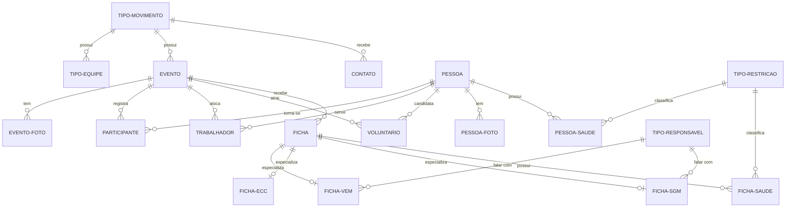

# Esquema Resumido do Banco de Dados

Este documento serve como um mapa leve e de alta performance para consulta do banco de dados do projeto **PNSL-NTM**. Ele foi projetado para economizar tokens na janela de contexto de agentes de IA e fornecer referência rápida de tabelas, chaves e relacionamentos.

---

## 1. Diagrama de Relacionamentos (ERD)

---

## 2. Dicionário Compacto de Tabelas

### Tabelas de Configuração e Tipos
* **`tipo_responsavel`**
  - `idt_responsavel` (PK) | `des_responsavel` (ex: Pai, Mãe, Padrinho)
* **`tipo_restricao`**
  - `idt_restricao` (PK) | `des_restricao` | `tip_restricao` (Alergia, Intolerância, PNE)
* **`tipo_movimento`**
  - `idt_movimento` (PK) | `nom_movimento` (ECC, Segue-Me, VEM) | `des_sigla` | `dat_inicio`
* **`tipo_equipe`**
  - `idt_equipe` (PK) | `idt_movimento` (FK) | `des_grupo` (ex: Bandinha, Reportagem) | `txt_documento`

### Core de Eventos e Pessoas
* **`evento`**
  - `idt_evento` (PK) | `idt_movimento` (FK) | `des_evento` | `num_evento` | `dat_inicio` | `dat_termino` | `val_camiseta` | `val_trabalhador` | `val_venista` | `val_entrada` | `tip_evento` (E, P, D) | `txt_informacao`
* **`pessoa`**
  - `idt_pessoa` (PK) | `idt_usuario` (FK -> `users`) | `nom_pessoa` | `nom_apelido` | `tel_pessoa` | `dat_nascimento` | `des_endereco` | `eml_pessoa` | `tam_camiseta` | `tip_genero` | `ind_toca_violao` | `ind_consentimento` | `ind_restricao`

### Relacionamentos e Detalhamentos
* **`pessoa_saude`** (PK composta: `idt_pessoa`, `idt_restricao`)
  - `idt_pessoa` (FK) | `idt_restricao` (FK) | `ind_remedio_regular` | `txt_complemento`
* **`participante`**
  - `idt_participante` (PK) | `idt_pessoa` (FK) | `idt_evento` (FK) | `tip_cor_troca` | *Unique:* (`idt_pessoa`, `idt_evento`)
* **`trabalhador`**
  - `idt_trabalhador` (PK) | `idt_pessoa` (FK) | `idt_evento` (FK) | `idt_equipe` (FK) | `ind_coordenador` | `ind_primeira_vez` | `ind_recomendado` | `ind_lideranca` | `ind_destaque` | `ind_avaliacao` | `ind_camiseta_pediu` | `ind_camiseta_pagou` | *Unique:* (`idt_pessoa`, `idt_evento`, `idt_equipe`)
* **`voluntario`**
  - `idt_voluntario` (PK) | `idt_pessoa` (FK) | `idt_evento` (FK) | `idt_equipe` (FK) | `idt_trabalhador` (FK, nullable) | `txt_habilidade` | *Unique:* (`idt_pessoa`, `idt_evento`, `idt_equipe`)

### Fichas e Inscrições (Ciclo Polimórfico)
* **`ficha`**
  - `idt_ficha` (PK) | `idt_evento` (FK) | `idt_pessoa` (FK, nullable) | `tip_genero` | `nom_candidato` | `nom_apelido` | `dat_nascimento` | `tel_candidato` | `eml_candidato` | `des_endereco` | `tam_camiseta` | `tip_como_soube` | `ind_catolico` | `ind_toca_instrumento` | `ind_consentimento` | `tip_situacao` (Enum/Situação da Ficha) | `ind_restricao` | `txt_observacao`
* **`ficha_vem`** (PK: `idt_ficha`)
  - `idt_ficha` (FK) | `idt_falar_com` (FK -> `tipo_responsavel`) | `des_onde_estuda` | `des_mora_quem` | `nom_pai` | `tel_pai` | `nom_mae` | `tel_mae`
* **`ficha_ecc`** (PK: `idt_ficha`)
  - `idt_ficha` (FK) | `nom_conjuge` | `nom_apelido_conjuge` | `tel_conjuge` | `dat_nascimento_conjuge` | `tam_camiseta_conjuge`
* **`ficha_sgm`** (PK: `idt_ficha`)
  - `idt_ficha` (FK) | `idt_falar_com` (FK -> `tipo_responsavel`) | `des_mora_quem` | `nom_pai` | `tel_pai` | `nom_mae` | `tel_mae`
* **`ficha_saude`** (Unique: `idt_ficha`, `idt_restricao`)
  - `idt_ficha` (FK) | `idt_restricao` (FK) | `txt_complemento`

### Comunicação
* **`contato`**
  - `idt_contato` (PK) | `dat_contato` | `nom_contato` | `eml_contato` | `tel_contato` | `txt_mensagem` | `idt_movimento` (FK)
